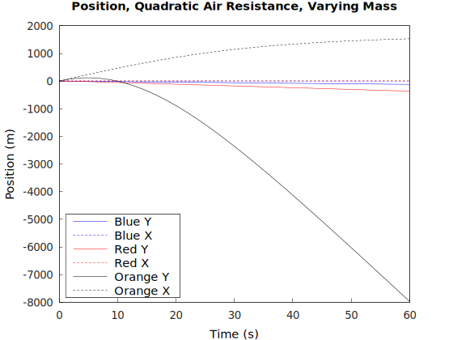
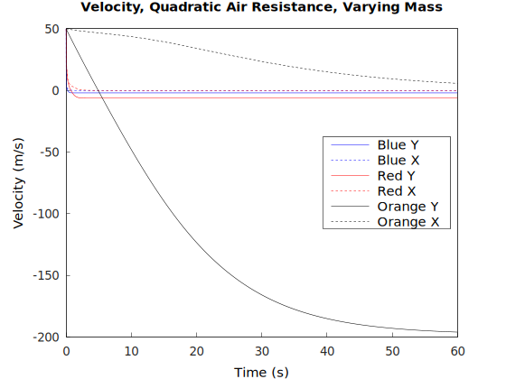
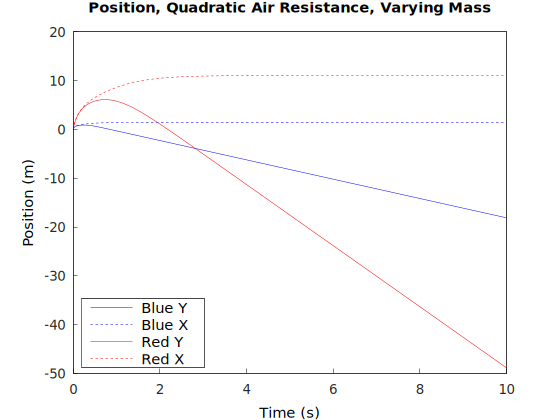
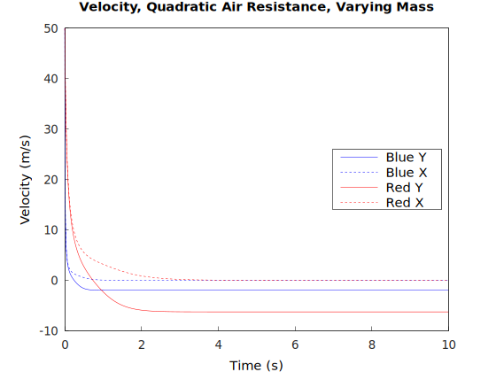
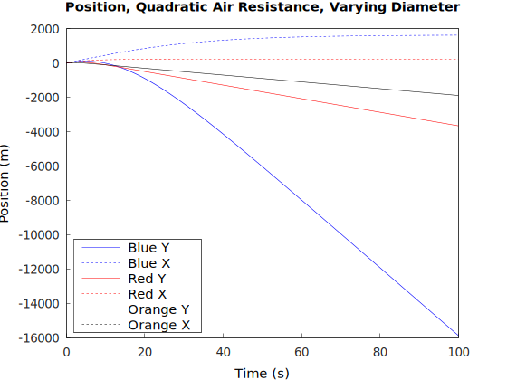
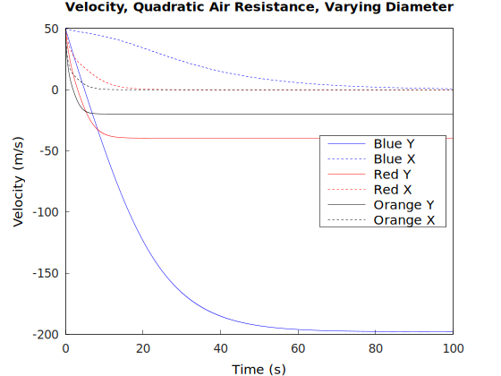
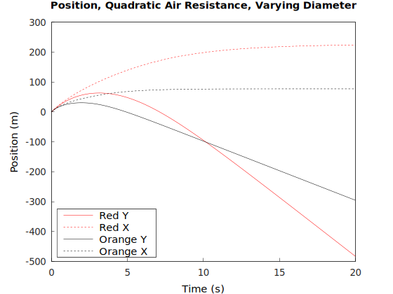
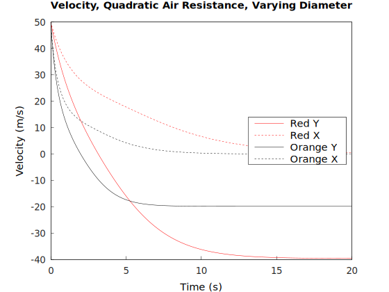

# Two Dimensional Motion, and Quadratic Air Resistance
## Investigation of falling bodies using raylib, and my own RK4 Numerical Integrator
=====================================================================================

In my Falling_Bodies program, I demonstrate how in a vaccuum, objects fall with the same acceleration while no resistance is present

In this program, there is a non-conservative force at play, (drag) that changes the terminal velocity based on the mass (and shape) of the object

Here, spheres will be used, and we are assuming Standard Temperature and Pressure (STP) which is the standard temperature and pressure at the surface of the Earth.

## Why is the air resistance quadratic here? Why not Linear? Even when |v| == 0? 

One can see which force (linear or quadratic drag) dominates, or if both need to be considered by taking the ratio and making a decision.

From Taylor's Classical Mechanics, page 44 and 45.

Assuming the drag force is always in the exact opposite direction of the velocity, and the object is a sphere, we can make the following statements

$\large \vec{f} = -f(v)\mathbf{\hat{v}}$

$\large f(v) = bv + c v^2 = f_{lin} + f_{quad}$

$\large b = \beta D$ $\hspace{1cm}$ $\large c = \gamma D^2$

Where

$\large \beta = 1.6 \times 10^{-4}\   N\ s / m^2$  $\hspace{1cm}$  $\large \gamma = 0.25\   N\ s^2 / m^4$

$\large \frac{f_{quad}}{f_{lin}} = \frac{cv^{2}}{bv}\ = \frac{\gamma D}{\beta}v\ = (1.6 \times 10^{3}\ \frac{s}{m^2})\ D v$ 

Since the ratio is such a large number for essentially all values (except where |v| = 0), this means that the quadratic force dominates

So for the split second where the velocity in the y direction is 0, this should be treated as linear, but we are interested in smooth, continuous equations for now,
we will be treating these as smooth functions, with quadratic drag only.

And for most of the flight of the sphere, this will be quadratic.

## The Equations of Motion for Quadratic Drag

$$
\left.
\begin{aligned}
m \ddot{x} &= -c \sqrt{\dot{x}^2 + \dot{y}^2}\ \dot{x} \\
m \ddot{y} &= m g - c \sqrt{\dot{x}^2 + \dot{y}^2}\ \dot{y}
\end{aligned}
\right\.
$$

Since these equations have both x and y components mixed into **both** equations, this is a coupled, second order ordinary differential equation, and we must numerically integrate as such.

## Varying Mass

Here, all of the diameters of the spheres are 1 meter, and the masses vary.

$m_{b} = 0.1 \text{ kg}$  $\hspace{1cm}$ $m_{r} = 10.0 \text{ kg}$ $\hspace{1cm}$ $m_{o} = 1000.0 \text{ kg}$

As you can see, the orange sphere, which is much more massive, takes a longer time to reach it's terminal velocity let's investigate why this is.

When the net force acting upon an object is equal to 0, there is no more acceleration, so setting net force = 0,

$\large g = \frac{c}{m} \sqrt{\dot{x^2} + \dot{y^2}}\ \dot{y}$

The orange mass is very massive compared to the other two, hence the right term here is small, because we are dividing by a large number

In order for this right term to grow, to reach g, it must have a higher y velocity or a lower mass (because $c\$ is constant here, so that's why it takes longer to reach it's terminal velocity compared to the other two.

Here are the terminal velocities of all spheres involved

As you can see, the orange ball falls much faster than the other two. This is like dropping a bowling ball versus a fairly light balloon.

Now let's ignore the orange ball, and compare the other two masses

These are fairly comparable, but still different. Let's see how they interact on screen.

Friendly reminder that each pixel is a meter, so the width of the physics world you are looking at is 1.9 kilometers by ~ 1km

## Varying Diameter

Let's vary the $c\$ parameter, by changing the diameter, and keeping the mass constant

All masses here are 1000 kg

The diameters of the blue, red, and orange spheres respectively, are

$\large d_{b} = 1 \text{ m}$ $\hspace{1cm}$ $\large d_{r} = 5 \text{ m}$ $\hspace{1cm}$ $\large d_{o} = 10 \text{ m}$

Now, the blue sphere takes some time to reach terminal velocity, but why is this?

The c value is small relative to all of the other c values, making the right side of the equation struggle to reach the value of g

The reason this time is because the sphere's surface area is so small compared to it's mass that it takes a little over a minute for the sphere to reach it's terminal velocity

The other two spheres are more compareable, but as you can see, it only takes these are 20 seconds to reach their terminal velocities

Now we can see that air resistance clearly affects the rate at which objects fall 

